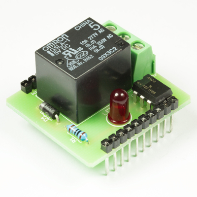

💾 Relay Childboard
===================

# 📸 Image

# 📂 Description

The LXRobotics Relay Childboard allows to turn on/off a load via a relay. The switching status of the relay is visualized by a red status LED. High quality screw terminals ensure stable and durable connection. For a quick and easy start, an open source Arduino library with sample programs is available.

**Features**

* Control a single load via a relay
* Max current. 10 A
* Max. DC voltage: 24 V DC
* Max. AC voltage: 250 V AC
* Relay-Type: SPDT (Single Pole commutator)
* Red signal LED shows relay status (ON/OFF)
* Optocouplers insulate Arduino from Relay circuit
* High quality screw terminals
* Can be used with the Radioshield the Childboard Adaptershield
* Arduino Library with example programs is available on GitHub

# 🎥 [Video](images/childboard_relay_demo.mp4)
